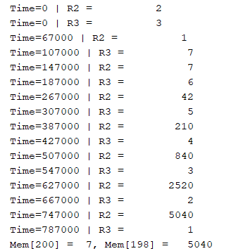
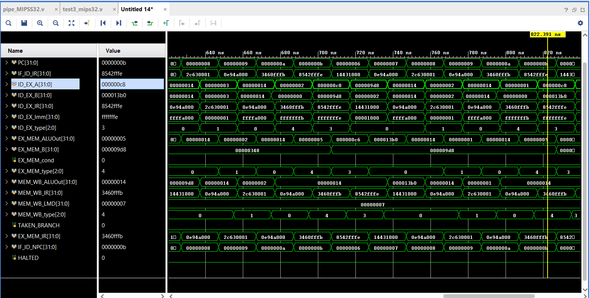

# Pipelined 32-bit MicroMIPS Processor (Verilog)

**Author:** Nishit Rupavatia

This project implements a **32-bit pipelined MicroMIPS processor** using **Verilog HDL**, supporting a subset of the MicroMIPS instruction set. The processor is designed with a 5-stage pipeline architecture and includes basic hazard detection and branch handling mechanisms.

---

##  Features

- **5-Stage Pipeline**: Instruction Fetch (IF), Instruction Decode (ID), Execute (EX), Memory Access (MEM), and Write-Back (WB)
- **Instruction Set Support**: Arithmetic, logic, memory access, immediate operations, and branch instructions
- **Hazard Handling**: Control hazard resolution using branch prediction bypass
- **Branch Logic**: Support for `BEQZ` and `BNEQZ` with conditional execution control
- **32 Registers**: Register file with 32 general-purpose 32-bit registers
- **Memory**: 1024 x 32-bit word-addressable memory
- **Clocking**: Two-phase clock (`clk1`, `clk2`) for sequential stage updates

---

##  Architecture Overview

The processor is divided into the following pipeline stages:

### 1. Instruction Fetch (IF)
- Fetches instruction from memory
- Handles branch redirection if a branch is taken

### 2. Instruction Decode (ID)
- Decodes instruction fields
- Reads source operands from the register file
- Sign-extends immediate values
- Classifies instruction types for further stages

### 3. Execute (EX)
- Performs ALU operations (arithmetic, logic, comparison)
- Calculates effective address for memory access
- Determines branch target and condition

### 4. Memory Access (MEM)
- Reads/writes memory for load and store instructions
- Passes ALU results to the write-back stage for register operations

### 5. Write Back (WB)
- Writes results back to the register file
- Halts execution on HLT instruction

---

##  Instruction Set Supported

| Opcode     | Operation       | Type     |
|------------|------------------|----------|
| `000000`   | ADD              | R-type   |
| `000001`   | SUB              | R-type   |
| `000010`   | AND              | R-type   |
| `000011`   | OR               | R-type   |
| `000100`   | SLT              | R-type   |
| `000101`   | MUL              | R-type   |
| `001010`   | ADDI             | I-type   |
| `001011`   | SUBI             | I-type   |
| `001100`   | SLTI             | I-type   |
| `100000`   | LW               | I-type   |
| `100001`   | SW               | I-type   |
| `001101`   | BNEQZ            | Branch   |
| `001110`   | BEQZ             | Branch   |
| `111111`   | HLT              | Special  |

---

## Simulation & Testing

- Multiple test programs were executed to verify the processor functionality.
- Waveform analysis was performed using a Verilog simulator.
- Instructions tested include arithmetic, memory access, and conditional branching.
- Registers and memory state are monitored to verify correctness at each pipeline stage.

---

## Testbench Example: Factorial of 7

To test control flow, loops, and arithmetic operations, a factorial computation was implemented in memory and executed by the processor.

---

## Expected Result

- Factorial of 7 = **5040**
- After execution, `Mem[198]` should contain **5040**

---

## Waveform & Output Snapshots

### Output Registers

###  Waveform Snapshot

##  Notes

- The processor uses **two-phase clocking** (`clk1`, `clk2`) to simulate realistic stage transitions.
- **No forwarding or full hazard detection** logic is implemented yet — stalls may not be fully handled.
- **Control hazards** are mitigated by suppressing instructions after a taken branch.

